# Control Signal Transport & Manager 架構說明書

## 1. 系統概覽

Control Signal Transport 提供一套統一的控制訊號傳輸介面，支援 **Topic 模式**（Pub/Sub）與 **Service 模式**（Client/Server）兩種傳輸方式，並由 **ControlSignalManager (CSM)** 統一管理 Source 與 Sink 的生命週期。

### 系統架構圖

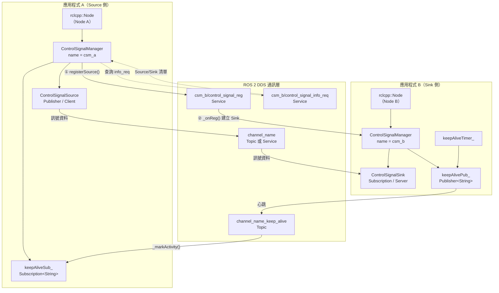

### 傳輸模式與訊息型別對應

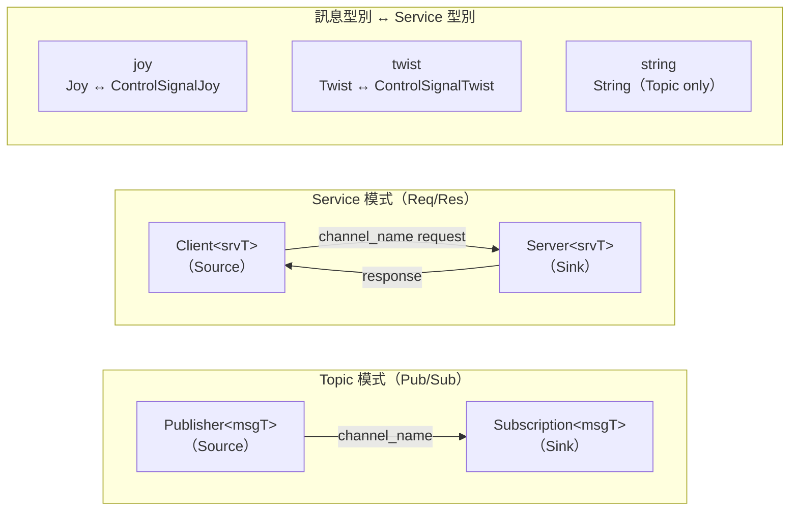

---

## 2. UML 類別圖

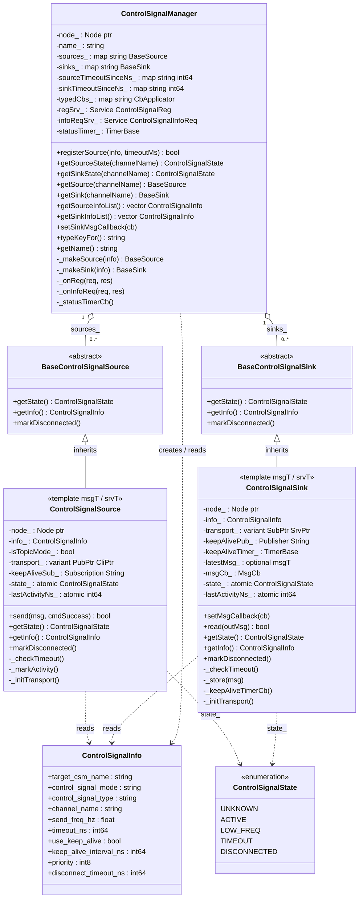

---

## 3. 狀態機圖

### Source / Sink 共用狀態機

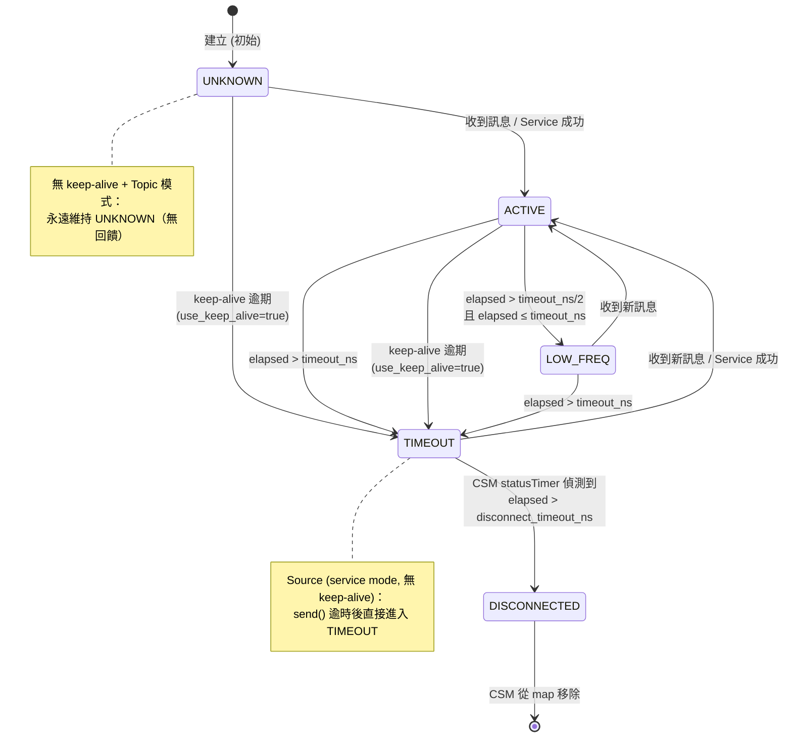

---

## 4. 流程圖

### 4.1 Source 註冊流程

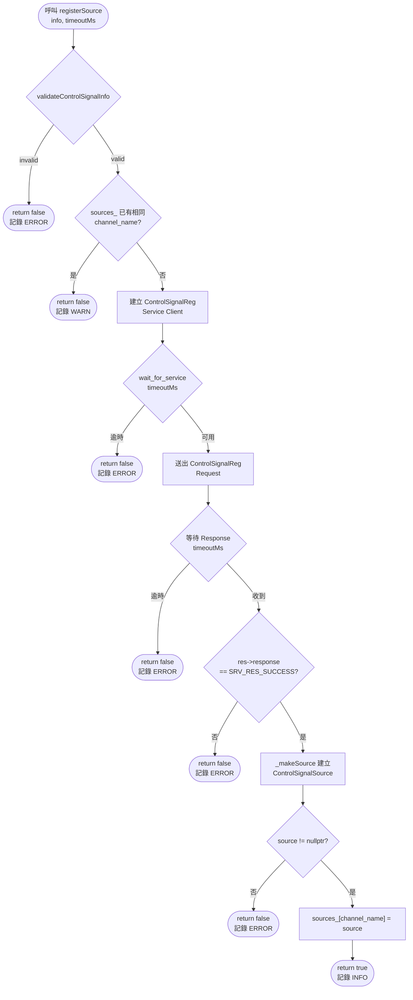

### 4.2 Topic 模式訊號傳輸流程

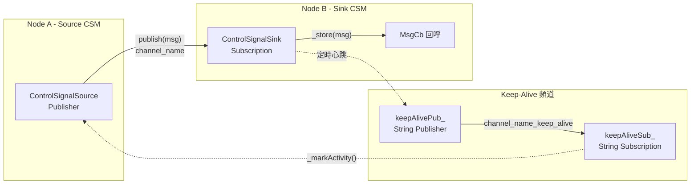

### 4.3 Service 模式訊號傳輸流程

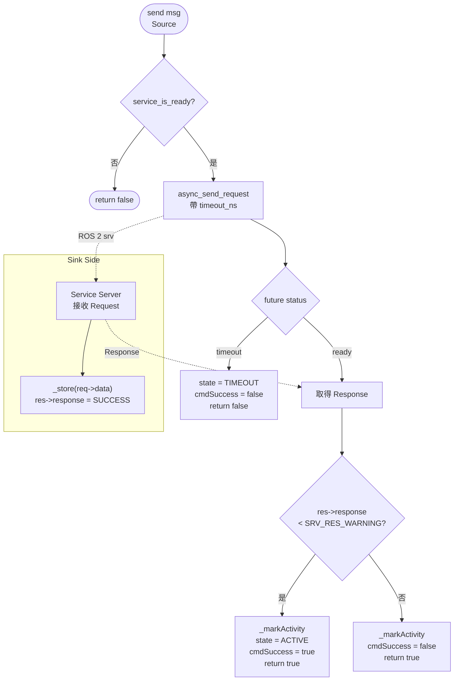

---

## 5. 時序圖

### 5.1 registerSource() 跨 CSM 時序

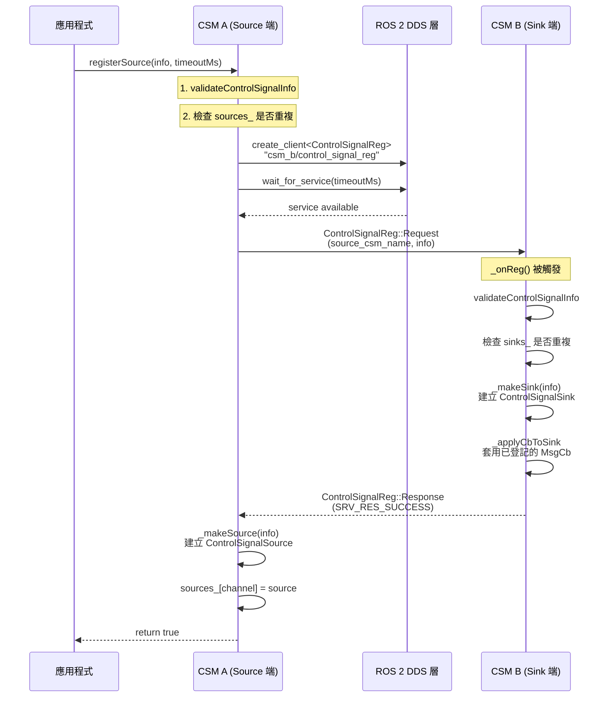

### 5.2 Topic 模式訊號傳輸時序

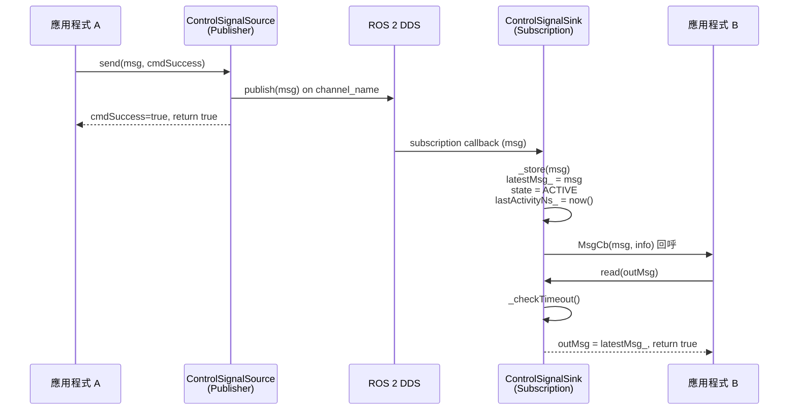

### 5.3 Service 模式訊號傳輸時序

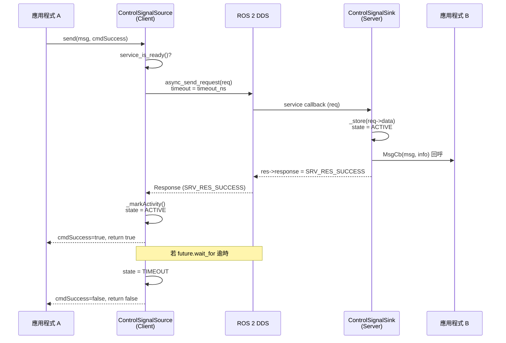

### 5.4 Keep-Alive 心跳機制時序

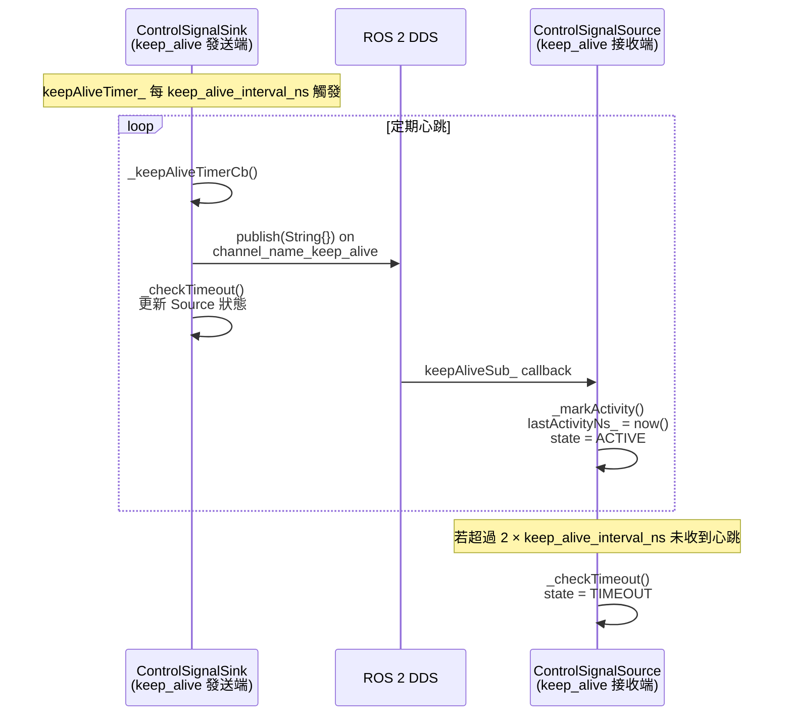

### 5.5 TIMEOUT → DISCONNECTED 生命週期時序

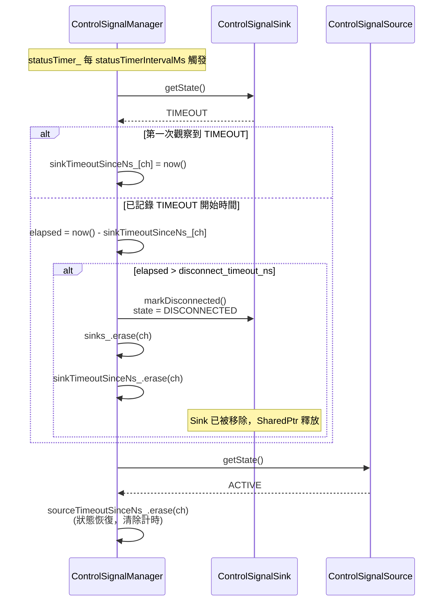

---

## 6. API 文件

### 6.1 ControlSignalInfo 訊息欄位

`rv2_interfaces::msg::ControlSignalInfo`

| 欄位 | 型別 | 說明 |
|------|------|------|
| `target_csm_name` | `string` | Sink 所在 CSM 的名稱；`registerSource` 會連線至此 CSM |
| `control_signal_mode` | `string` | 傳輸模式：`"topic"` 或 `"service"` |
| `control_signal_type` | `string` | 訊號類型：`"joy"`、`"twist"`、`"string"` |
| `channel_name` | `string` | ROS 2 topic 或 service 名稱，作為 Source/Sink 的唯一鍵 |
| `send_freq_hz` | `float` | 預期傳送頻率（Hz），供監控參考 |
| `timeout_ns` | `int64` | Sink 端 ACTIVE→TIMEOUT 的閾值（ns）；`0` 表示停用 |
| `use_keep_alive` | `bool` | 啟用心跳機制 |
| `keep_alive_interval_ns` | `int64` | 心跳週期（ns）；Sink 發送、Source 接收 |
| `priority` | `int8` | 訊號優先度（預留欄位，參考 ControlSignalConst 常數） |
| `disconnect_timeout_ns` | `int64` | CSM 連續偵測 TIMEOUT 超過此值後移除條目；`0` 表示停用 |

---

### 6.2 ControlSignalConst 常數

`rv2_interfaces::msg::ControlSignalConst`

#### 模式常數

| 常數名稱 | 值 | 說明 |
|---------|-----|------|
| `CONTROL_SIGNAL_MODE_TOPIC` | `"topic"` | Topic 傳輸模式 |
| `CONTROL_SIGNAL_MODE_SERVICE` | `"service"` | Service 傳輸模式 |
| `CONTROL_SIGNAL_MODE_UNKNOWN` | `"unknown"` | 未知模式 |

#### 型別常數

| 常數名稱 | 值 | 對應 msgT |
|---------|-----|----------|
| `CONTROL_SIGNAL_TYPE_JOY` | `"joy"` | `sensor_msgs::msg::Joy` |
| `CONTROL_SIGNAL_TYPE_TWIST` | `"twist"` | `geometry_msgs::msg::Twist` |
| `CONTROL_SIGNAL_TYPE_STRING` | `"string"` | `std_msgs::msg::String` |
| `CONTROL_SIGNAL_TYPE_UNKNOWN` | `"unknown"` | — |

#### 優先度常數

| 常數名稱 | 值 | 說明 |
|---------|-----|------|
| `CONTROL_SIGNAL_PRIORITY_EMERGENCY_STOP` | `100` | 緊急停止 |
| `CONTROL_SIGNAL_PRIORITY_HIGH` | `80` | 高優先度 |
| `CONTROL_SIGNAL_PRIORITY_MEDIUM` | `50` | 中優先度 |
| `CONTROL_SIGNAL_PRIORITY_LOW` | `20` | 低優先度 |
| `CONTROL_SIGNAL_PRIORITY_UNKNOWN` | `-1` | 未設定 |

---

### 6.3 ControlSignalState 列舉

```cpp
enum class ControlSignalState
{
    UNKNOWN,      // 初始狀態，尚未收到任何訊息
    ACTIVE,       // 正常運作中
    LOW_FREQ,     // 收到訊息但低於預期頻率 (elapsed > timeout_ns/2)
    TIMEOUT,      // 曾為 ACTIVE/LOW_FREQ，但超過 timeout_ns 未有活動
    DISCONNECTED  // 終態：由 CSM 於超過 disconnect_timeout_ns 後設定並移除
};
```

| 狀態 | 觸發條件 | 可轉出至 |
|------|---------|---------|
| `UNKNOWN` | 建構時初始 | `ACTIVE`、`TIMEOUT`（keep-alive 逾期） |
| `ACTIVE` | 收到訊息 / Service 回應成功 | `LOW_FREQ`、`TIMEOUT` |
| `LOW_FREQ` | elapsed > timeout_ns/2 且 ≤ timeout_ns | `ACTIVE`、`TIMEOUT` |
| `TIMEOUT` | elapsed > timeout_ns | `ACTIVE`、`DISCONNECTED` |
| `DISCONNECTED` | CSM 判定 | —（終態） |

---

### 6.4 BaseControlSignalSource

抽象基底類別，定義 Source 共用介面。

```cpp
class BaseControlSignalSource
```

#### 方法

---

##### `getState()`

```cpp
virtual ControlSignalState getState() const = 0;
```

**說明**: 取得 Source 目前狀態，同時執行被動逾時檢查。

**回傳**: 目前的 `ControlSignalState`

**狀態判斷邏輯**:
- `use_keep_alive = false`，Topic 模式 → 永遠返回 `UNKNOWN`（無回饋）
- `use_keep_alive = false`，Service 模式 → 返回 `send()` 設定的狀態
- `use_keep_alive = true` → 若距最後心跳 > `2 × keep_alive_interval_ns`，轉為 `TIMEOUT`

---

##### `getInfo()`

```cpp
virtual const msg::ControlSignalInfo& getInfo() const = 0;
```

**說明**: 取得此 Source 的完整 `ControlSignalInfo` 描述子。

**回傳**: 常數參考 `ControlSignalInfo`

---

##### `markDisconnected()`

```cpp
virtual void markDisconnected() = 0;
```

**說明**: 將此 Source 設定為終態 `DISCONNECTED`。僅由 CSM 的 `_statusTimerCb()` 呼叫。呼叫後 `getState()` 返回 `DISCONNECTED`，CSM 隨即從 `sources_` 移除此物件。

---

### 6.5 BaseControlSignalSink

抽象基底類別，定義 Sink 共用介面。

```cpp
class BaseControlSignalSink
```

#### 方法

---

##### `getState()`

```cpp
virtual ControlSignalState getState() const = 0;
```

**說明**: 取得 Sink 目前狀態，同時執行被動逾時檢查。

**狀態判斷邏輯**:
- `UNKNOWN` → 初始，未收到任何訊息
- `ACTIVE` → 至少收過一則訊息，且 elapsed ≤ `timeout_ns / 2`
- `LOW_FREQ` → elapsed > `timeout_ns / 2` 且 ≤ `timeout_ns`
- `TIMEOUT` → elapsed > `timeout_ns`（`timeout_ns == 0` 時停用逾時）

---

##### `getInfo()`

```cpp
virtual const msg::ControlSignalInfo& getInfo() const = 0;
```

**說明**: 取得此 Sink 的完整 `ControlSignalInfo` 描述子。

---

##### `markDisconnected()`

```cpp
virtual void markDisconnected() = 0;
```

**說明**: 設定終態 `DISCONNECTED`。僅由 CSM 呼叫，呼叫後 CSM 從 `sinks_` 移除此物件。

---

### 6.6 ControlSignalSource\<msgT, srvT\>

繼承自 `BaseControlSignalSource`，帶型別的具體 Source 實作。

```cpp
template<typename msgT, typename srvT = void>
class ControlSignalSource : public BaseControlSignalSource
```

| Template 參數 | 說明 |
|--------------|------|
| `msgT` | ROS 2 訊息型別（`Joy`、`Twist`、`String`） |
| `srvT` | ROS 2 服務型別；預設 `void` 表示 Topic 模式 |

**傳輸 variant**:
- `isTopicMode_ == true` → `variant` 持有 `Publisher<msgT>::SharedPtr`
- `isTopicMode_ == false` → `variant` 持有 `Client<srvT>::SharedPtr`

#### 建構子

```cpp
ControlSignalSource(rclcpp::Node* node, const msg::ControlSignalInfo& info)
```

| 參數 | 說明 |
|------|------|
| `node` | 父節點指標，必須比此物件存活更久 |
| `info` | 控制訊號描述子 |

**初始狀態**: `UNKNOWN`

---

#### `send()`

```cpp
bool send(const msgT& msg, bool& cmdSuccess)
```

**說明**: 傳送控制訊號。呼叫前會先執行被動逾時檢查。

| 參數 | 方向 | 說明 |
|------|------|------|
| `msg` | 輸入 | 要傳送的訊號內容 |
| `cmdSuccess` | 輸出 | `true` 表示指令被接受（service mode 下對方回應成功） |

**回傳**: `true` 表示訊息成功發送；`false` 表示傳輸層不可用

**行為差異**:

| 模式 | 行為 |
|------|------|
| **Topic** | 直接 `publish(msg)`，`cmdSuccess = true`，狀態不變（無回饋） |
| **Service** | `async_send_request` 並等待 `timeout_ns`；成功 → `_markActivity()`, `cmdSuccess` 依回應；逾時 → `state = TIMEOUT`, `cmdSuccess = false`, `return false` |

---

#### `getState()` / `getInfo()` / `markDisconnected()`

繼承介面，同 §6.4 說明。

---

### 6.7 ControlSignalSink\<msgT, srvT\>

繼承自 `BaseControlSignalSink`，帶型別的具體 Sink 實作。

```cpp
template<typename msgT, typename srvT = void>
class ControlSignalSink : public BaseControlSignalSink
```

| Template 參數 | 說明 |
|--------------|------|
| `msgT` | ROS 2 訊息型別 |
| `srvT` | ROS 2 服務型別；`void` 表示 Topic 模式 |

**Callback 型別**:
```cpp
using MsgCb = std::function<void(const msgT&, const msg::ControlSignalInfo&)>;
```

#### 建構子

```cpp
ControlSignalSink(rclcpp::Node* node, const msg::ControlSignalInfo& info)
```

| 參數 | 說明 |
|------|------|
| `node` | 父節點指標，必須比此物件存活更久 |
| `info` | 控制訊號描述子 |

若 `use_keep_alive == true` 且 `keep_alive_interval_ns > 0`，建構時自動：
- 建立 `Publisher<String>` on `channel_name + "_keep_alive"`
- 建立 wall timer，每 `keep_alive_interval_ns` 觸發心跳發布與逾時檢查

---

#### `setMsgCallback()`

```cpp
void setMsgCallback(MsgCb cb)
```

**說明**: 登記（或替換）每次收到訊息時的回呼函式。

| 參數 | 說明 |
|------|------|
| `cb` | 回呼函式；傳入 `nullptr` 以清除 |

> **執行緒安全**: 可在收訊執行緒與呼叫端執行緒並行呼叫。  
> **注意**: 回呼在 ROS 2 subscription/service 執行緒中觸發，須保持非阻塞且執行緒安全。

---

#### `read()`

```cpp
bool read(msgT& outMsg) const
```

**說明**: 讀取最新收到的訊息，同時執行被動逾時檢查。

| 參數 | 方向 | 說明 |
|------|------|------|
| `outMsg` | 輸出 | 最新訊息；若尚未收到任何訊息則為 `msgT{}` |

**回傳**: `true` 表示 state 為 `ACTIVE`；`false` 表示尚無訊息或已逾時

---

#### `getState()` / `getInfo()` / `markDisconnected()`

繼承介面，同 §6.5 說明。

---

### 6.8 Factory Functions

提供從 `ControlSignalInfo` 動態建立 Source/Sink 的工廠函式，依 `control_signal_type` 分派。

#### `makeControlSignalSource<srvT>()`

```cpp
template<typename srvT = void>
std::shared_ptr<BaseControlSignalSource>
makeControlSignalSource(rclcpp::Node* node, const msg::ControlSignalInfo& info)
```

| Template 參數 | 說明 |
|--------------|------|
| `srvT` | 服務型別；省略（`void`）表示 Topic 模式 |

| 參數 | 說明 |
|------|------|
| `node` | 父節點指標 |
| `info` | 控制訊號描述子 |

**回傳**: `BaseControlSignalSource` 的 `shared_ptr`；`control_signal_type` 不支援時返回 `nullptr`

**分派對照**:

| `info.control_signal_type` | 建立型別 |
|---------------------------|---------|
| `"joy"` | `ControlSignalSource<Joy, srvT>` |
| `"twist"` | `ControlSignalSource<Twist, srvT>` |
| `"string"` | `ControlSignalSource<String, srvT>` |
| 其他 | `nullptr` |

---

#### `makeControlSignalSink<srvT>()`

```cpp
template<typename srvT = void>
std::shared_ptr<BaseControlSignalSink>
makeControlSignalSink(rclcpp::Node* node, const msg::ControlSignalInfo& info)
```

參數與回傳邏輯同 `makeControlSignalSource`，建立對應的 Sink 實例。

---

### 6.9 ControlSignalManager

管理多個 Source 與 Sink 的生命週期，並提供跨 CSM 的 Source 註冊協定。

```cpp
class ControlSignalManager
```

> **執行緒需求**: 父節點必須在另一個執行緒中持續 spinning（`rclcpp::spin` 或 `MultiThreadedExecutor`），才能呼叫 `registerSource()`。

#### 建構子

```cpp
ControlSignalManager(rclcpp::Node* node,
                     const std::string& name,
                     int64_t statusTimerIntervalMs = 1000)
```

| 參數 | 說明 |
|------|------|
| `node` | 父節點指標，必須比此物件存活更久 |
| `name` | 管理器唯一名稱；用作 service 的前綴 |
| `statusTimerIntervalMs` | 狀態檢查 timer 週期（ms），預設 1000 ms |

**建構時自動廣播的 Services**:

| Service 名稱 | 型別 | 說明 |
|-------------|------|------|
| `<name>/control_signal_reg` | `srv::ControlSignalReg` | 接受遠端 Source 的 Sink 建立請求 |
| `<name>/control_signal_info_req` | `srv::ControlSignalInfoReq` | 回傳所有 Source/Sink 的 Info 列表 |

---

#### `registerSource()`

```cpp
bool registerSource(const msg::ControlSignalInfo& info, int64_t timeoutMs = 5000)
```

**說明**: 向目標 CSM 發送 Source 註冊請求，並於成功後在本地建立 Source。

| 參數 | 說明 |
|------|------|
| `info` | Source 描述子；`info.target_csm_name` 指定目標 CSM |
| `timeoutMs` | 等待目標 CSM 回應的最長時間（ms） |

**回傳**: `true` 表示成功；`false` 表示驗證失敗、已存在、逾時或被拒絕

**執行步驟**:
1. `validateControlSignalInfo(info)` — 欄位合法性檢查
2. 檢查 `sources_` 是否已有相同 `channel_name`
3. 連線至 `info.target_csm_name + "/control_signal_reg"`
4. 發送 `ControlSignalReg::Request` 並等待回應
5. 回應為 `SRV_RES_SUCCESS` → `_makeSource(info)` + 存入 `sources_`

> **⚠ 注意**: 禁止在 single-threaded executor 的 ROS 2 回呼中呼叫，否則會死鎖。

---

#### `getSourceState()` / `getSinkState()`

```cpp
ControlSignalState getSourceState(const std::string& channelName) const
ControlSignalState getSinkState(const std::string& channelName) const
```

**說明**: 依 `channel_name` 查詢 Source/Sink 的目前狀態。

**回傳**: 對應狀態；若 `channel_name` 不存在則返回 `UNKNOWN`

---

#### `getSource()` / `getSink()`

```cpp
std::shared_ptr<BaseControlSignalSource> getSource(const std::string& channelName) const
std::shared_ptr<BaseControlSignalSink>   getSink(const std::string& channelName) const
```

**說明**: 依 `channel_name` 取得 Source/Sink 的 shared_ptr。

**回傳**: 對應物件的 `shared_ptr`；不存在時返回 `nullptr`

---

#### `getSourceInfoList()` / `getSinkInfoList()`

```cpp
std::vector<msg::ControlSignalInfo> getSourceInfoList() const
std::vector<msg::ControlSignalInfo> getSinkInfoList() const
```

**說明**: 取得所有 Source/Sink 的 `ControlSignalInfo` 列表（快照）。

**執行緒安全**: 是

---

#### `setSinkMsgCallback<msgT>()`

```cpp
template<typename msgT>
void setSinkMsgCallback(
    std::function<void(const msgT&, const msg::ControlSignalInfo&)> cb)
```

**說明**: 為指定訊息型別 `msgT` 登記 Sink 收訊回呼。

- 呼叫後**立即**套用至所有已存在的同型別 Sink
- 後續新建的同型別 Sink 也會自動套用
- 傳入 `nullptr` 可清除回呼
- 同型別只能登記一個回呼（後者覆蓋前者）

**執行緒安全**: 是

**範例**:
```cpp
csm.setSinkMsgCallback<sensor_msgs::msg::Joy>(
    [](const sensor_msgs::msg::Joy& joy,
       const rv2_interfaces::msg::ControlSignalInfo& info) {
        // 處理 Joy 訊號
    });
```

---

#### `typeKeyFor<msgT>()`

```cpp
template<typename msgT>
static std::string typeKeyFor()
```

**說明**: 靜態工具函式，返回 `msgT` 對應的 `ControlSignalConst` 型別字串。

| `msgT` | 回傳值 |
|--------|--------|
| `sensor_msgs::msg::Joy` | `"joy"` |
| `geometry_msgs::msg::Twist` | `"twist"` |
| `std_msgs::msg::String` | `"string"` |
| 其他 | `"unknown"` |

---

#### getName()

```cpp
const std::string& getName() const
```

**回傳**: 此 CSM 的名稱字串（即建構子傳入的 `name`）

---

## 附錄：使用範例

### 完整的跨節點 Source/Sink 建立

```cpp
// ── Node B 先啟動，CSM_B 開始監聽 ────────────────────────────
auto node_b = std::make_shared<rclcpp::Node>("node_b");
auto csm_b  = std::make_shared<rv2_interfaces::ControlSignalManager>(node_b.get(), "csm_b");

// 登記 Joy Sink 的訊息回呼
csm_b->setSinkMsgCallback<sensor_msgs::msg::Joy>(
    [](const sensor_msgs::msg::Joy& joy,
       const rv2_interfaces::msg::ControlSignalInfo& info) {
        RCLCPP_INFO(rclcpp::get_logger("app_b"),
            "Joy received on channel '%s'", info.channel_name.c_str());
    });

auto exec_b = std::make_shared<rclcpp::executors::MultiThreadedExecutor>();
exec_b->add_node(node_b);
std::thread spin_b([&]{ exec_b->spin(); });

// ── Node A 建立 Source ────────────────────────────────────────
auto node_a = std::make_shared<rclcpp::Node>("node_a");
auto csm_a  = std::make_shared<rv2_interfaces::ControlSignalManager>(node_a.get(), "csm_a");

auto exec_a = std::make_shared<rclcpp::executors::MultiThreadedExecutor>();
exec_a->add_node(node_a);
std::thread spin_a([&]{ exec_a->spin(); });

rv2_interfaces::msg::ControlSignalInfo info;
info.target_csm_name       = "csm_b";
info.control_signal_mode   = rv2_interfaces::msg::ControlSignalConst::CONTROL_SIGNAL_MODE_TOPIC;
info.control_signal_type   = rv2_interfaces::msg::ControlSignalConst::CONTROL_SIGNAL_TYPE_JOY;
info.channel_name          = "/robot/joy";
info.send_freq_hz          = 50.0f;
info.timeout_ns            = 200'000'000LL;   // 200 ms
info.use_keep_alive        = true;
info.keep_alive_interval_ns = 100'000'000LL;  // 100 ms
info.disconnect_timeout_ns  = 2'000'000'000LL; // 2 s

bool ok = csm_a->registerSource(info, 5000);
// ok == true → csm_a 持有 Source；csm_b 持有 Sink

// ── 傳送訊號 ─────────────────────────────────────────────────
auto src = csm_a->getSource("/robot/joy");
// down-cast 或透過 CSM send wrapper 使用
```
